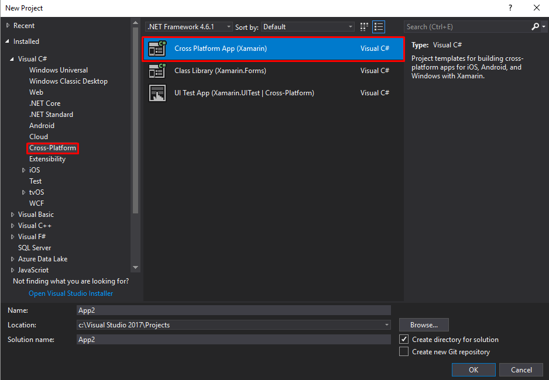
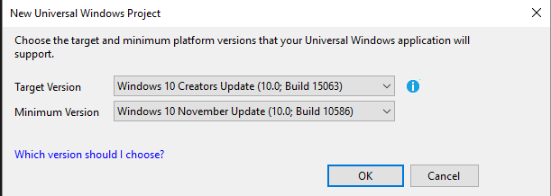

# Quick Tasks App Tutorial Part 1

## 1. Create Project & Select Xamarin

- Visual Studio -> File -> New -> Project

## 2. Select CrossPlatforms Settings
- Prefered Xamarin Forms & PCL (Portable class library)

## 3. Select Version Settings
- Ideal is this settings

# You got this!

