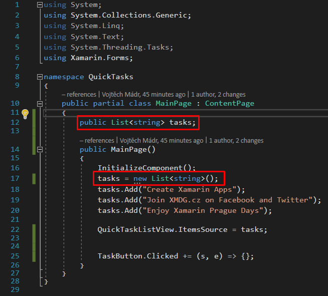

# Quick Tasks App Tutorial Part 3


## 1. Add StackLayout with Entry and Button

* Open MainPage.xaml, put Listview to StackLayout and add Entry and Button with attributes

```csharp
<StackLayout>
	<ListView x:Name="QuickTaskListView" />
	<Entry HorizontalOptions="Fill" Placeholder="Write task" x:Name="TaskExtry"/>[
	<Button HorizontalOptions="Fill"  Text="Add Task" x:Name="TaskButton"/>
</StackLayout>
```

## 2. Create tasks system


 1. Open MainPage.xaml.cs file and and event under current code

```csharp
TaskButton.Clicked += (s, e) => { };
```

2. Move list to public field

+

3. Get text from extry and add to list + clear list

```csharp
TaskButton.Clicked += (s, e) => {
	var text = TaskExtry.Text;
	tasks.Add(text);
	TaskExtry.Text = "";
};
```


4. Change list to ObservableCollection

```csharp
public ObservableCollection<string> tasks;
```

## You got this!

+


## Tip

* Add Xamlc support to AssemblyInfo.cs
```csharp
[assembly: XamlCompilation(XamlCompilationOptions.Compile)]
```